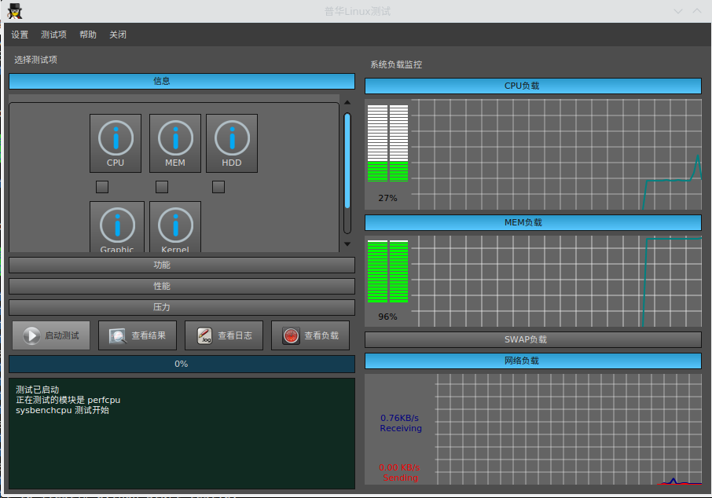
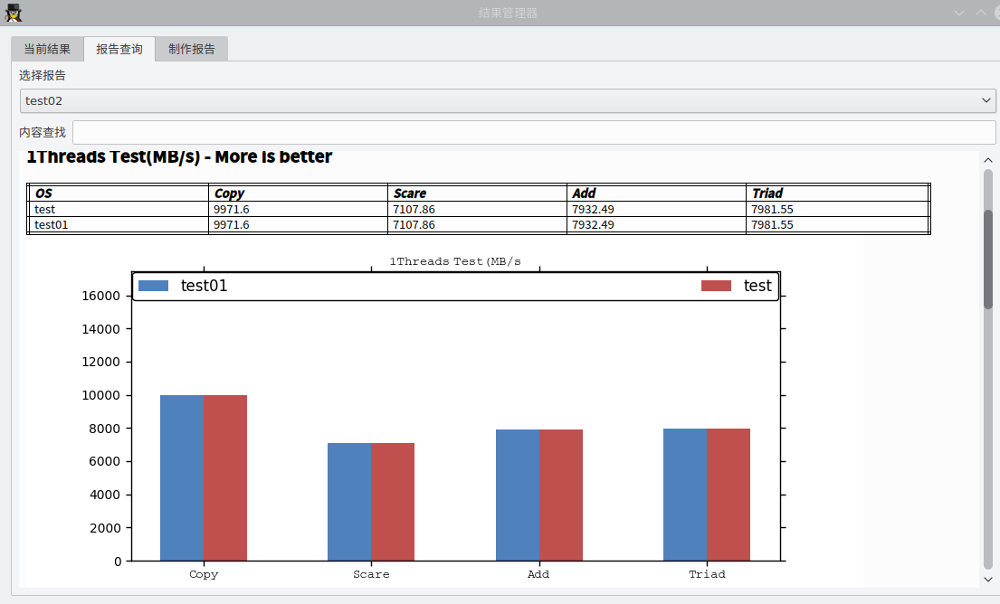

# Report_generate
### support list
    * Perf_cpu  sysbenchcpu(v) spec2000(x) spec2006(x)
    * Perf_mem  sysbenchmem(v) stream(v)
    * Perf_thread pingpong(v)
    * Perf_io     iozone(v)
    * Perf_system unixbench(v)
    * Perf_kernel lmbench(v)
    * Perf_browser 
    * Perf_graphics

### Main Window

### Report Window

